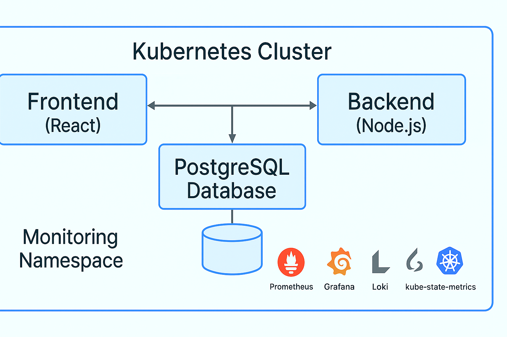

# 🧠 MEMORY GAME KUBERNETES APP WITH COMPLETE MONITORING STACK

<div align="center">
  

  <br />

  [](https://opensource.org/licenses/MIT)
  [](CONTRIBUTING.md)
  [](https://github.com/Osomudeya/full-stack/stargazers)
  [](https://github.com/Osomudeya/full-stack/network/members)
  [](https://www.linkedin.com/in/osomudeya-zudonu-17290b124/)
</div>

## 📚 Table of Contents
- [Architecture Overview](#-architecture-overview)
- [Features](#-features)
- [Prerequisites](#️-prerequisites)
- [Local Development](#-local-development)
- [Kubernetes Deployment (Minikube)](#️-kubernetes-deployment-minikube)
- [Kubernetes Deployment (AKS)](#️-kubernetes-deployment-aks)
- [Monitoring Stack](#-monitoring-stack)
- [SLIs, SLOs, and SLAs](#-slis-slos-slas)
- [Access Applications](#-access-applications)
- [Troubleshooting](#️-troubleshooting)
- [Contributing](#-contributing)
- [License](#-license)

## 🚀 Architecture Overview
The project is a full-stack cloud-native application consisting of:

| Component | Technology |
|-----------|------------|
| Frontend | React (memory matching game) |
| Backend | Node.js Express API |
| Database | PostgreSQL |
| Monitoring | Prometheus, Grafana, Loki, Promtail, kube-state-metrics |

All components are containerized, Kubernetes-ready, and monitored!

## ✨ Features
- 🧠 Fun Memory Card Matching Game
- 🌐 Fully Containerized App
- 🚀 AKS + Minikube Support
- 📊 Metrics Collection (Prometheus)
- 📈 Dashboards (Grafana)
- 📝 Centralized Logging (Loki + Promtail)
- 🔥 Kubernetes Health Monitoring (kube-state-metrics)
- 🛡️ Self-healing probes and resource limits
- 💬 Slack / Email alert templates ready

## 🛠️ Prerequisites
- Docker
- Docker Compose
- Minikube
- Azure CLI + Terraform (for AKS)
- kubectl
- Helm (optional)

## 🧪 Local Development
```bash
# Clone repo
git clone https://github.com/yourusername/memory-game-k8s-monitoring.git
cd memory-game-k8s-monitoring/application

# Run Docker Compose
docker compose up -d #or docker compose up -d 

# Access app
http://localhost:3000
```

## ☸️ Kubernetes Deployment (Minikube)
```bash
# Start Minikube
minikube start --driver=docker --cpus=4 --memory=8g

# Enable Ingress
minikube addons enable ingress

# Build and Load Images
cd application
docker build -t memory-game-frontend:latest ./frontend
docker build -t memory-game-backend:latest ./backend
minikube image load memory-game-frontend:latest
minikube image load memory-game-backend:latest

# Deploy App
kubectl apply -f ../kubernetes/application/

# Deploy Monitoring
kubectl apply -f ../kubernetes/monitoring/

# Update Hosts
echo "$(minikube ip) memory-game.local monitoring.local" | sudo tee -a /etc/hosts
```

## ☸️ Kubernetes Deployment (AKS)
```bash
# Provision AKS Cluster (Terraform)
cd terraform
terraform init
terraform apply

# Connect to Cluster
az aks get-credentials --resource-group your-rg --name your-cluster

# Build & Push Images to ACR
az acr login --name youracr
docker build -t youracr.azurecr.io/memory-game-frontend:latest ./frontend
docker build -t youracr.azurecr.io/memory-game-backend:latest ./backend
docker push youracr.azurecr.io/memory-game-frontend:latest
docker push youracr.azurecr.io/memory-game-backend:latest

# Update Deployment YAMLs
sed -i 's|memory-game-frontend:latest|youracr.azurecr.io/memory-game-frontend:latest|g' ../kubernetes/application/frontend-deployment.yaml
sed -i 's|memory-game-backend:latest|youracr.azurecr.io/memory-game-backend:latest|g' ../kubernetes/application/backend-deployment.yaml

# Deploy App
kubectl apply -f ../kubernetes/application/

# Deploy Monitoring
kubectl apply -f ../kubernetes/monitoring/
```

## 📈 Monitoring Stack

| Tool | Purpose |
|------|---------|
| Prometheus | Scrape app and cluster metrics |
| Grafana | Visualize metrics and logs |
| Loki | Aggregate application logs |
| Promtail | Collect container logs |
| kube-state-metrics | Expose Kubernetes resource metrics |

Dashboards are auto-provisioned.

## 🎯 SLIs, SLOs, SLAs

| Metric | Target (SLO) |
|--------|--------------|
| Uptime | 99.9% successful HTTP responses |
| Latency | 95% of requests < 300ms |
| Error Rate | < 0.1% 5xx errors |
| Resource Usage | CPU < 80%, Memory < 85% |

Visualized automatically in Grafana.

## 🌐 Access Applications

| Service | URL |
|---------|-----|
| Frontend | http://memory-game.local |
| Grafana | http://monitoring.local/grafana |
| Prometheus | http://monitoring.local/prometheus |
| Logs (Loki via Grafana) | http://monitoring.local/grafana |

Default Grafana Login: `admin` / `admin`

(Or `admin` / `$GRAFANA_PASSWORD` if deployed.)

## 🛠️ Troubleshooting

| Problem | Solution |
|---------|----------|
| Images not loading | Use `minikube image load` |
| Database errors | Check secrets and DB pod logs |
| Ingress 404 | Verify Ingress Controller running |
| Missing metrics | Check Prometheus scrape targets |
| No logs in Grafana | Check Promtail DaemonSet pods |

## 🤝 Contributing
Pull requests are welcome! Please open an issue first to discuss what you would like to change.

## 📜 License
This project is licensed under the MIT License.

## 🌟 Show Your Support!
If you like this project:

- ⭐ Star it on GitHub
- ⬇️ Download it
- 🍴 Fork it
- 🛠️ Use it for your own app monitoring!

## 🏗️ Architecture Diagram

```
+--------------------------------------+
| Kubernetes Cluster                   |
|                                      |
| +-----------+    +--------------+    |
| | Frontend  |    |   Backend     |    |
| +-----------+    +--------------+    |
|         \             /               |
|        PostgreSQL Database             |
|            |                           |
| +------------------------------------+ |
| | Monitoring Namespace (Prometheus,  | |
| | Grafana, Loki, Promtail, KSM)       | |
| +------------------------------------+ |
+--------------------------------------+

```

## 📢 Deployment Status
- ✅ Minikube Ready
- ✅ AKS Ready
- ✅ Metrics + Logs
- ✅ Monitoring included
- ✅ Production-grade structure